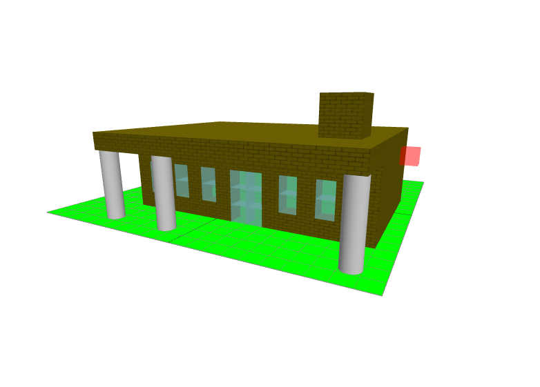

# House Builder
> A test 'minecraft' like voxel builder built with three.js

## Development setup
```bash
# Uses yarn package manager and webpack for development and build processes
# Install external dependencies
yarn install

# start development server
npm run serve
```

## Build
```bash
# builds to ./app directory
npm run build
```

## Demo
1. To insert a shape select the shape and the material and *click* on the 
plane
1. To remove a shape *shift click* on the shape to remove
1. To rotate the scene *drag* while holding down the mouse

## Example
